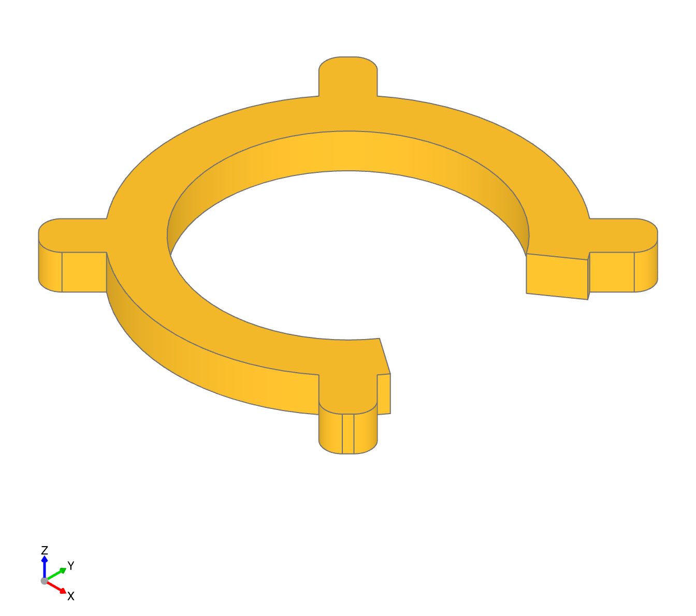

# build123d models

A collection of 3D models created using [build123d](https://github.com/build123d/build123d)

### Credits

- [build123d](https://github.com/build123d/build123d)

### Requirements

To use build123d, you need to install the following dependencies:

```bash
pip install build123d
```

For model visualization (optional, used in examples):
```bash
pip install ocp-vscode
```

**System requirements:**
- Python 3.8 or higher
- OpenCASCADE (installed automatically with build123d)

### How to use

```python
from build123d import *
```

### Models

#### Ring Clamp



E27 ring clamp created for [The Swirl Lamp](https://makerworld.com/en/models/738820-the-swirl-lamp#profileId-671097) model on Makerworld.

**Customizable Parameters:**

You can modify the following parameters in `clamp.py` to customize the ring clamp:

- `outer_radius` (default: 25) - Outer radius of the ring in mm
- `inner_radius` (default: 37.2/2) - Inner radius of the ring in mm (adjust for different bulb sizes)
- `thickness` (default: 5) - Part thickness/height in mm
- `cutout_angle` (default: 70) - Angle of the cutout section in degrees
- `ear_radius` (default: 3) - Half-width of each ear protrusion in mm
- `ear_height` (default: 9.8) - Length of the ear protrusion in mm
- `num_ears` (default: 4) - Number of ears around the ring

**Files:**
- [clamp.py](ring_clamp/clamp.py) - Source code
- [ring_clamp.stl](ring_clamp/ring_clamp.stl) - 3D model file
- [Model on Makerworld]() // TODO

