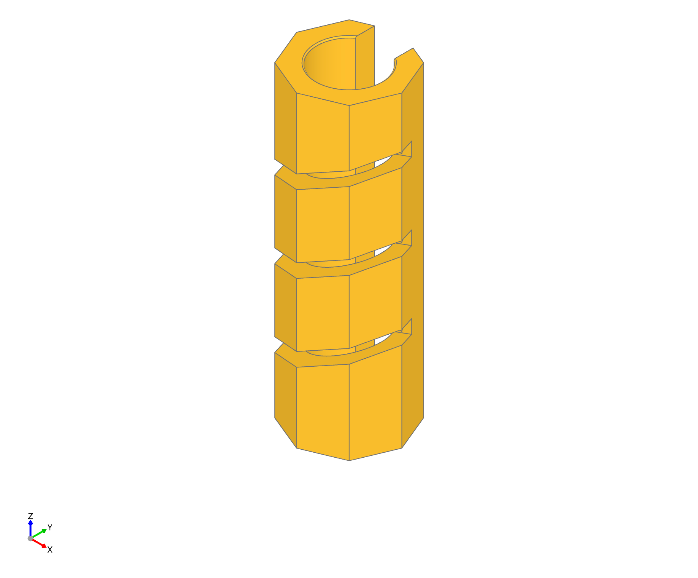
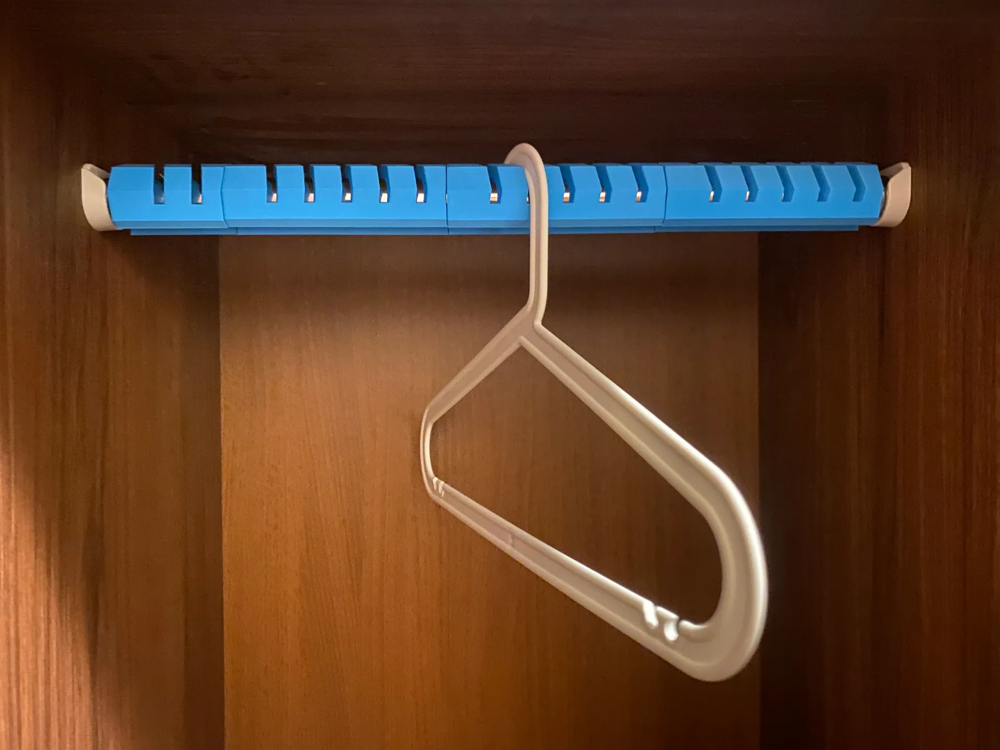
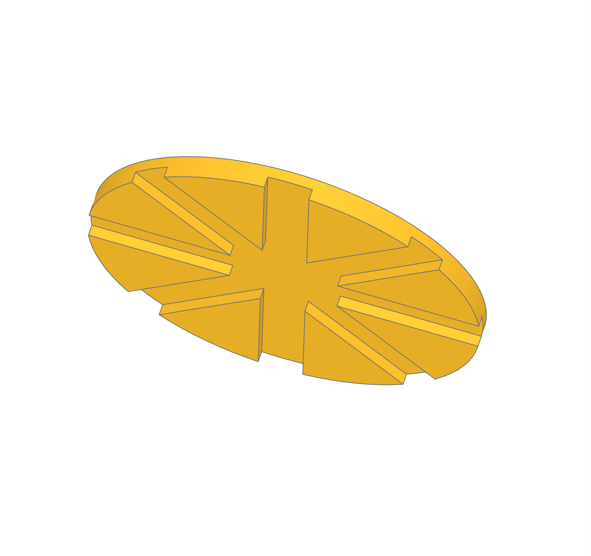
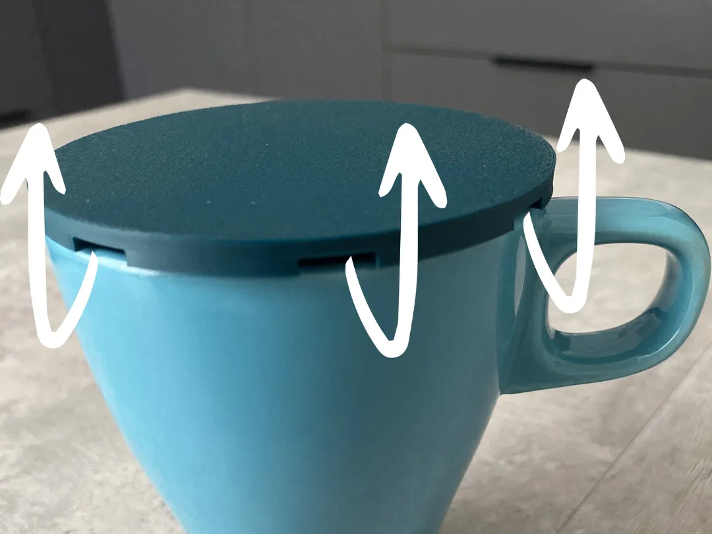
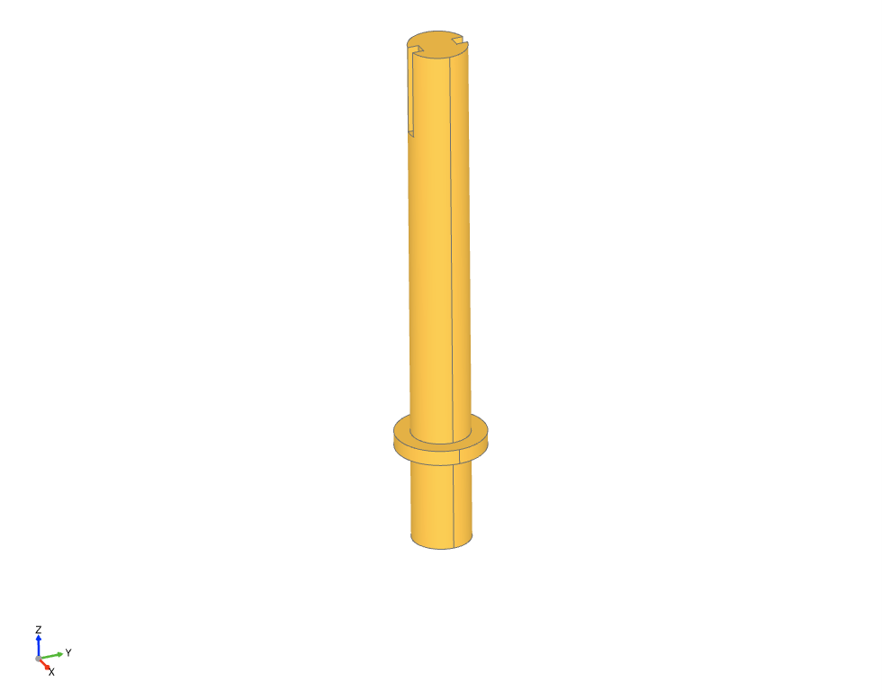
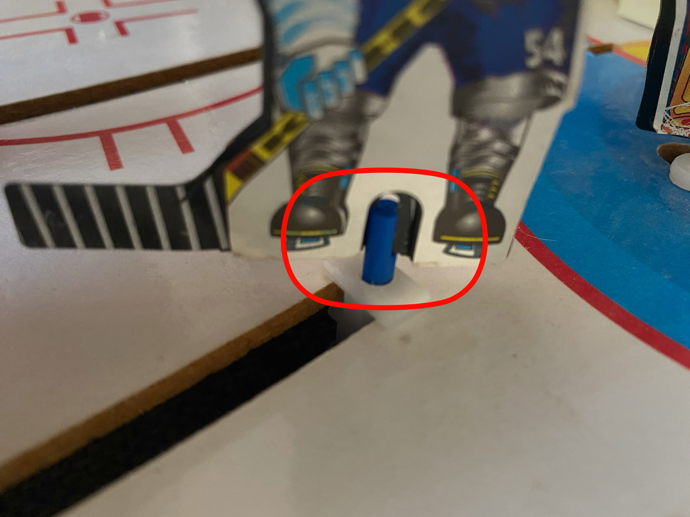

# build123d models

A collection of 3D models created using [build123d](https://github.com/build123d/build123d)

### Credits

- [build123d](https://github.com/build123d/build123d)

### Models

- [Ring Clamp](#ring-clamp)
- [Closet Rod Adapter](#closet-rod-adapter)
- [Mug Dust Cover](#mug-dust-cover)
- [Hockey Player Holder](#hockey-player-holder)
- [Pomodoro Timer Enclosure](#pomodoro-timer-enclosure)

### Requirements

To use build123d, you need to install the following dependencies:

```bash
pip install build123d
```

For model visualization (optional, used in examples):
```bash
pip install ocp-vscode
```

**System requirements:**
- Python 3.8 or higher
- OpenCASCADE (installed automatically with build123d)

### How to use

```python
from build123d import *
```

### Models

#### Ring Clamp


E27 ring clamp created for [The Swirl Lamp](https://makerworld.com/en/models/738820-the-swirl-lamp#profileId-671097) model on Makerworld.

**Customizable Parameters:**

You can modify the following parameters in `clamp.py` to customize the ring clamp:

- `outer_radius` (default: 25) - Outer radius of the ring in mm
- `inner_radius` (default: 37.2/2) - Inner radius of the ring in mm (adjust for different bulb sizes)
- `thickness` (default: 5) - Part thickness/height in mm
- `cutout_angle` (default: 70) - Angle of the cutout section in degrees
- `ear_radius` (default: 3) - Half-width of each ear protrusion in mm
- `ear_height` (default: 9.8) - Length of the ear protrusion in mm
- `num_ears` (default: 4) - Number of ears around the ring

**Files:**
- [clamp.py](ring_clamp/clamp.py) - Source code
- [ring_clamp.stl](ring_clamp/ring_clamp.stl) - 3D model file

#### Closet Rod Adapter

| 3D Model | Real |
|:---:|:---:|
|  |  |

Adapter for closet rod for narrow closets with angled slots for hangers. Hangers are placed at an angle to fit in narrow closet. Octagonal shape for greater slot height.

**Customizable Parameters:**

You can modify the following parameters in `closet_rod_adapter.py` to customize the adapter:

- `rod_diameter` (default: 25) - Rod diameter in mm
- `rod_length` (default: 120) - Adapter length in mm
- `wall_thickness` (default: 3) - Adapter wall thickness in mm
- `slot_spacing` (default: 30) - Distance between slot centers in mm
- `slot_width` (default: 5) - Slot width in mm
- `slot_depth` (default: 45) - Slot depth in mm
- `slot_angle` (default: 20) - Slot angle in degrees
- `gap_width` (default: 15) - Width of bottom cut for installation in mm

**Files:**
- [closet_rod_adapter.py](closet_rod_adapter/closet_rod_adapter.py) - Source code
- [closet_rod_adapter.stl](closet_rod_adapter/closet_rod_adapter.stl) - 3D model file
- [Model on Makerworld](https://makerworld.com/en/models/2172973-closet-rod-adapter-customisable-with-build123d#profileId-2357070)
- [Model on Printables](https://www.printables.com/model/1533332-closet-rod-adapter-customisable-with-build123d)

#### Mug Dust Cover

| 3D Model | Real |
|:---:|:---:|
|  |  |

Dust cover for a mug. Bottom channels let moisture escape sideways while
keeping the top closed against falling dust.

**Customizable Parameters:**

- `mug_outer_diameter` - Mug outside diameter
- `overhang` - Cover overhang beyond the mug
- `top_thickness` - Cover thickness
- `vent_count` - Number of ventilation channels
- `vent_width` - Width of each ventilation channel
- `vent_height` - Height of each ventilation channel

**Files:**
- [mug_dust_cover.py](mug_dust_cover/mug_dust_cover.py) - Source code
- [mug_dust_cover.stl](mug_dust_cover/mug_dust_cover.stl) - 3D model file
- [Model on Makerworld](https://makerworld.com/en/models/3019858-mug-dust-cover#profileId-3392740)
- [Model on Printables](https://www.printables.com/model/1774129-mug-dust-cover)

#### Hockey Player Holder

| 3D Model | Real |
|:---:|:---:|
|  |  |

Holder for tabletop hockey game player figures. Tubular body with a wider collar and slits at the end for inserting player pieces.

**Customizable Parameters:**

- `tube_length` (default: 35) - Total tube length in mm
- `tube_dia` (default: 3.9) - Tube diameter in mm
- `collar_pos` (default: 7) - Distance from short end to collar in mm
- `collar_length` (default: 1) - Collar thickness in mm
- `collar_dia` (default: 6) - Collar outer diameter in mm
- `slit_depth` (default: 1) - How deep the notch cuts into the tube in mm
- `slit_height` (default: 6) - Length of slit along the tube axis in mm

**Files:**
- [hockey_player_holder.py](hockey_player_holder/hockey_player_holder.py) - Source code
- [hockey_player_holder.stl](hockey_player_holder/hockey_player_holder.stl) - 3D model file
- [Model on Makerworld](https://makerworld.com/en/models/3094867-hockey-player-holder#profileId-3487696)
- [Model on Printables](https://www.printables.com/model/1790789-hockey-player-holder)

#### Pomodoro Timer Enclosure

Flip-to-start Pomodoro enclosure for the Waveshare ESP32-S3 Touch AMOLED
1.8. It holds the complete device in its factory black enclosure
(45.2 × 37.6 mm). The device drops into a snug pocket in the body. A front
lid with the screen opening clicks on with four hidden cantilever tongues
and an 8 mm deep frame. Matching scallops under the seam on two faces are
enough to take the lid off by hand. A chamfered rectangular USB-C port sits
on the +X face. The cavity behind the device is a light honeycomb so it
prints without supports.

Four ready-to-print variants live in subfolders. Each can be with or without
printed PWR/BOOT push-buttons, and with or without side engraving:

- `buttons/labeled` - push-buttons and default 5 / 10 / 30 / 60
- `buttons/unlabeled` - push-buttons, blank sides
- `no_buttons/labeled` - no button bores, default 5 / 10 / 30 / 60
- `no_buttons/unlabeled` - blank cube

The four side texts are the `LABELS` tuple in
`pomodoro_timer_enclosure.py`, in order +Y, +X (USB), -Y, -X. Change those
strings and re-run the script to engrave your own presets on the labeled
variants. Empty strings skip a face.

Assembly (button variants): drop the two buttons into their bores from
inside the body, lay the device into the pocket, then press the lid on
until the tongues click. The button positions come from the official board
STEP model; adjust `BUTTON_Y` and `BUTTON_Z` if the factory case places its
keys elsewhere.

**Main parameters:**

- Case size: 52 × 52 × 46 mm
- Wall thickness: 1.8 mm
- Corner radius: 3.2 mm
- Device pocket: 37.9 × 45.5 × 15.5 mm
- Screen window: 30.1 × 36.3 mm
- USB-C port: 14 × 10 mm bore, chamfered to 15.6 × 11.6 mm
- Engraving size/depth: 22 / 0.55 mm
- Rear honeycomb: 11 mm pitch, 0.8 mm walls
- Lid frame: 8 mm deep, 0.25 mm clearance per side
- Lid retention: four 12 mm tongues, 0.45 mm engagement each
- Grip scallops: 16 × 2.2 mm, 1 mm deep, on the 5 and 30 faces
- Push-buttons: 4.4 × 5 mm bores at ±10.5 mm, 0.5 mm free travel, caps 0.3 mm
  below the face

**Files:**

- [pomodoro_timer_enclosure.py](pomodoro_timer_enclosure/pomodoro_timer_enclosure.py) - Parametric source
- [buttons/labeled](pomodoro_timer_enclosure/buttons/labeled), [buttons/unlabeled](pomodoro_timer_enclosure/buttons/unlabeled)
- [no_buttons/labeled](pomodoro_timer_enclosure/no_buttons/labeled), [no_buttons/unlabeled](pomodoro_timer_enclosure/no_buttons/unlabeled)
- Each folder has `body` and the same wide-channel `lid`; button variants also have `button` (print 2)
- STEP files are available beside each STL

**References:**

- [Official Waveshare board STEP model](https://files.waveshare.com/wiki/ESP32-S3-Touch-AMOLED-1.8/ESP32-S3-Touch-AMOLED-1.8-3D.zip)
- [Waveshare hardware resources](https://docs.waveshare.com/ESP32-S3-Touch-AMOLED-1.8/Resources-And-Documents)
- [USB-C charging base on Printables](https://www.printables.com/model/1355637-waveshare-esp32-s3-18inch-amoled-touch-display-3d)

### License

[MIT](https://github.com/khlebobul/build123d_models/blob/main/LICENSE)
